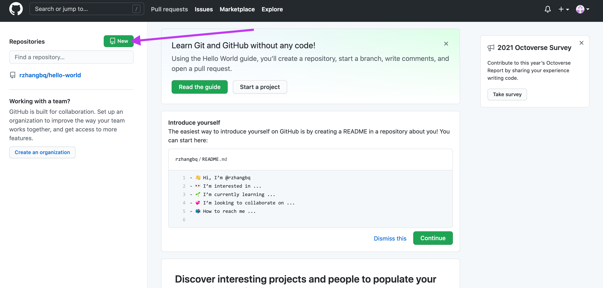
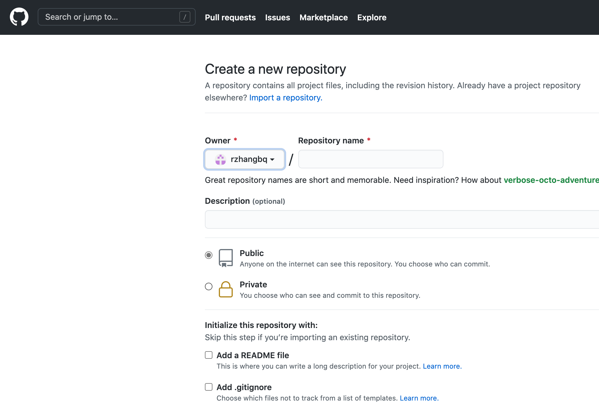
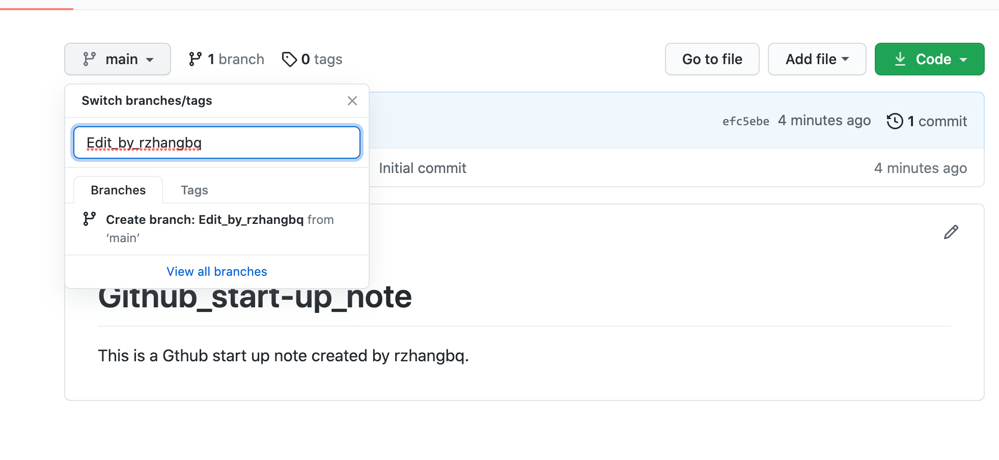
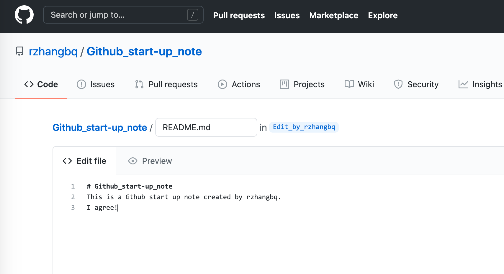

# Github start-up note

## 1. Create a github account

- omitted

## 2. Create a Repository

- Click new at the top left of rzhangbq's personal main-page.

-  Edit some settings
   - Set the name to Github_start-up_note (space is not available) 
     - I will use this repository to store my Github start-up note
   - Set it to public, so that you have no excuse not to read it
     - Which means, you could be **very willing** to read it
   - Add a README file in order to initialize the repository. This will help me create a default branch
     - If you are new to Github, you are recommended to cilck the [learn more](https://docs.github.com/en/github/creating-cloning-and-archiving-repositories/about-readmes) buttom
   - Click <button>create repository</button>

## 3. Create a new branch

- Click <button>main ↓</button>

- Edit README.md
   - This should be written with markdown language
   
     - [Markdown basic grammar](https://github.com/YukonChen/TiantianRepoForQNXG/blob/master/Notes/01_Markdown快速入门笔记.md)
   
   - Make some changes
   
     
   
   - Click <button>commit changes</button>
   
- Upload a new file
