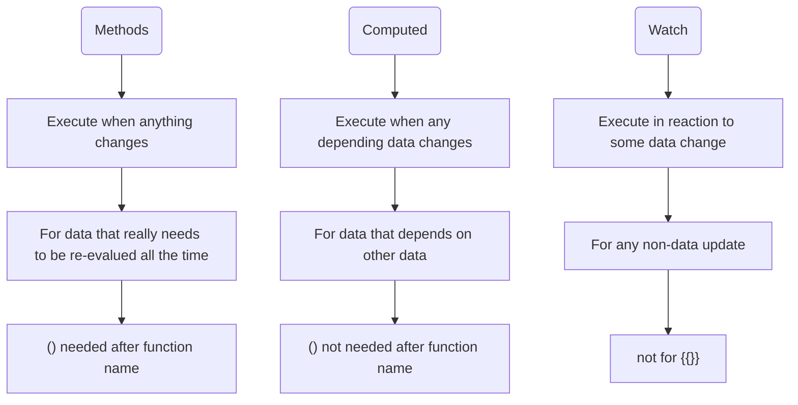

# Vue Notes

## 1. Bindings

1. {{}}

	- `{{ yourName }}`
	- `{{ yourAgeIn5() }} in 5 years`
	- `{{ Math.random() }}`
2. v-html
   - `<p v-html="outputGoal()"></p>`
3. v-bind

   - **short cut: `v-bind:`->`:`**
   - ``
   - `<input type="text" v-bind:value="showYourGoal" />`
4. v-on *calling a function on some event*
   - **short cut: `v-on:`->`@`**
   - `<button v-on:click="addCounter(4)">Add</button>`
   - `<button v-on:click.right="reduceCounter(4)">Remove</button>`
   - `<input type="text" v-on:keyup.enter="setName($event, 'ZHANG')" />`
   - `<input type="text" v-on:input="refreshOutputWhenInput" />`
     - To get value from input: `this.upperOutput = event.target.value;`
5. v-model *double binding with a certain variable*

   - `<input type="text" v-model="lowerOutput" />`

## 2. Watch, computed and methods



### Javascript setTimeout

```javascript
setTimeout(function () {
  ……;
}, 1000); // ms
}
)
```

## 3. Vue-controlled style
