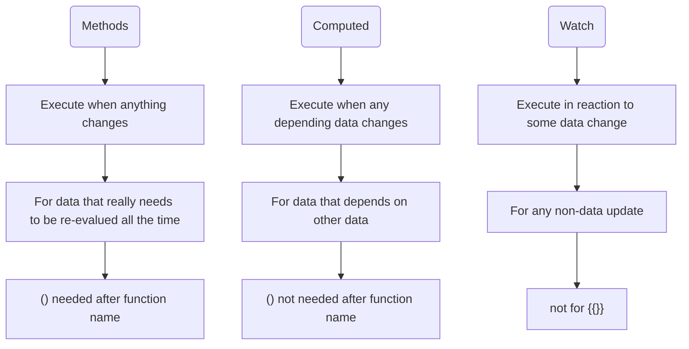
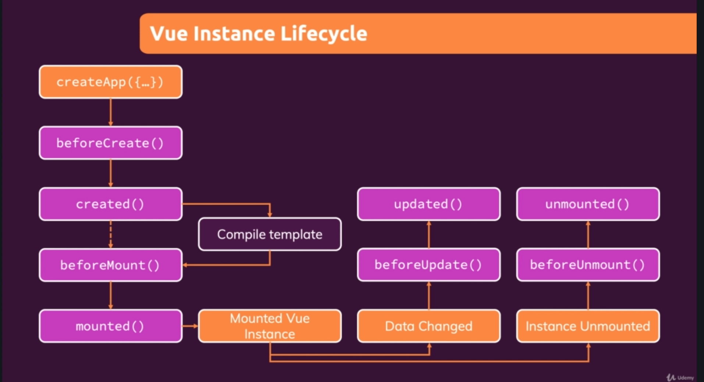

# Vue Notes

## 1. Bindings

1. {{}}

	- `{{ yourName }}`
	- `{{ yourAgeIn5() }} in 5 years`
	- `{{ Math.random() }}`
2. v-html
   - `<p v-html="outputGoal()"></p>`
3. v-bind

   - **short cut: `v-bind:`->`:`**
   - ``
   - `<input type="text" v-bind:value="showYourGoal" />`
4. v-on *calling a function on some event*
   - **short cut: `v-on:`->`@`**
   - `<button v-on:click="addCounter(4)">Add</button>`
   - `<button v-on:click.right="reduceCounter(4)">Remove</button>`
   - `<input type="text" v-on:keyup.enter="setName($event, 'ZHANG')" />`
   - `<input type="text" v-on:input="refreshOutputWhenInput" />`
     - To get value from input: `this.upperOutput = event.target.value;`
5. v-model *double binding with a certain variable*

   - `<input type="text" v-model="lowerOutput" />`

### only in {{}}, () is necessary for functions

## 2. Watch, computed and methods



### Javascript setTimeout

```javascript
setTimeout(function () {
  ……;
}, 1000); // ms

```

## 3. Vue-controlled style

1. `<div class="demo" :style="AStyle" @click="boxSelected('A')"></div>`

   ```javascript
   if(this.ASelected) {
     this.ASelected = false;
     this.AStyle = "border-color: '#ccc'";
   }
   else {
     this.ASelected = true;
     this.AStyle = "border-color: red; background-color: salmon;";
   }
   ```
   or
   
   ```javascript
   if(this.ASelected) {
     this.ASelected = false;
     this.AStyle = {borderColor: '#ccc'};
   }
   else {
     this.ASelected = true;
     this.AStyle = {borderColor: 'red', backgroundColor: 'salmon'};
   }
   ```
   
2. `<div class="demo" :style="{borderColor: BSelected? 'red' : '#ccc'}" @click="boxSelected('B')"></div>`

3. `<div :class="CSelected ? 'demo active': 'demo'" @click="boxSelected('C')"></div>`

   ```css
   .demo {
     width: calc(100% - 32px);
     height: 100px;
     margin: 16px;
     border: 2px dashed #ccc;
   }
   
   .active {
     border-color: red;
     background-color: salmon;
   }
   ```

4. `<div class="demo" :class="{active: DSelected}" @click="boxSelected('D')"></div>`

5. `<div :class="['demo', {active: ESelected}]" @click="boxSelected('E')"></div>`

6. ```html
   <input type="text" v-model="chosen_color1"/>
   <input type="text" v-model="chosen_color2"/>
   <p :style="{backgroundColor: chosen_color1, borderColor: chosen_color2}">Style me inline!</p>
   ```

## 4. Vue control

1. v-if

   ```vue
   <p v-if="condition"></p>
   <p v-else-if="condition"></p>
   ……
   <p v-else></p>
   ```

2. v-show

   ```vue
   <p v-show="condition"></p>
   <!-- similar to v-if, but this just hides-->
   ```

3. v-for

   ```vue
   <li 
       v-for="(goal, index) in goals" 
       :key="goal" >
     <!-- the key gives each box a unique identity -->
     <p>{{index + 1}} . {{goal}}</p>
   </li>
   ```

   *output is:*

   *1 . goal1*

   *2 . goal2* 

   *……*

   **Reminder: index at the back**

   `<p v-for="(value, key) in {name: 'sam', age: 18}">{{key}} : {{value}}</p>`

   *output is:* 

   *name : sam*

   *age : 18*

   **Reminder: {key:value} -> (value,key) **

   `<p v-for="i in 10">{{i}}</p>`
   
   output is:
   
   1-10
   
   **Reminder: starting from 1**

## 5. Vue process



```javascript
app.mount()		// mount app
app.unmount()	// unmount 
```

## 6. Introduction of Vue CLI
